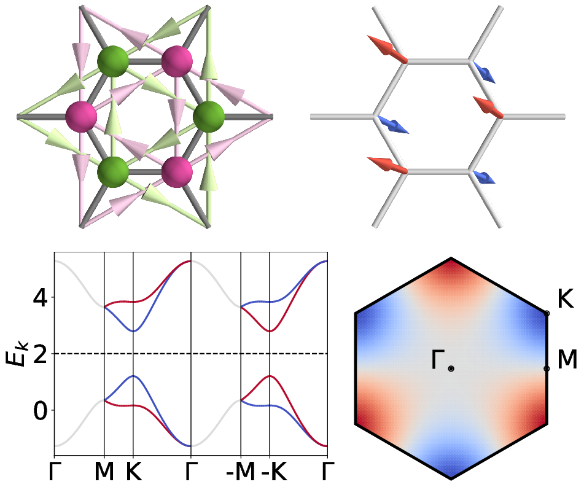

# Scientific python library for quantum materials/many-body lattice models
Since I started my postdoctoral stint at UC Berkeley, a significant portion of my research has been based on numerical computations of quantum many-body systems. To manage the codes for different projects harmoniously, I started to establish and maintain my own python library for versatile computations in theoretical condensed matter physics. My library is built upon fundamental scientific python libraries, such as numpy, scipy, and sparse for matrix and tensor computations, as well as matplotlib (2D) and mayavi (3D) for graphics. This library has supported my broad exploration into various quantum many-body systems for diverse 1D, 2D, and 3D quantum materials.

The main features of my library include:
1. Public repository on GitHub: https://github.com/kappaping/cmt_code
2. Wide applicability on arbitrary 1D to 3D lattices and Fermi-Hubbard models
3. Computation of band structures and superconducting/spin/charge ordered states:
  (1) Mean field: Hartree-Fock(-Bogoliubov) theory
  (2) Dynamics: Time-dependent Hartree-Fock(-Bogoliubov) theory
  (3) Beyond mean field: Functional renormalization group (RG), parquet RG
  (4) Classical Monte Carlo: Spin systems
4. 3D visualization of lattices and superconducting/spin/charge ordered states

**Demo: Altermagnetism on a honeycomb lattice**

This figure of altermagnetism ([arXiv:2503.09602](https://arxiv.org/abs/2503.09602)) demonstrates the computational and graphical capabilities in my package. The upper figures show (left) the Haldane model with charge currents on the honeycomb lattice, as well as (right) its altermagnetic ground state under repulsive interaction obtained by the Hartree-Fock theory. The lower figures show (left) the band structures with spin splitting and (right) the splitting energy map of the lower two occupied bands in the Brillouin zone.

  

