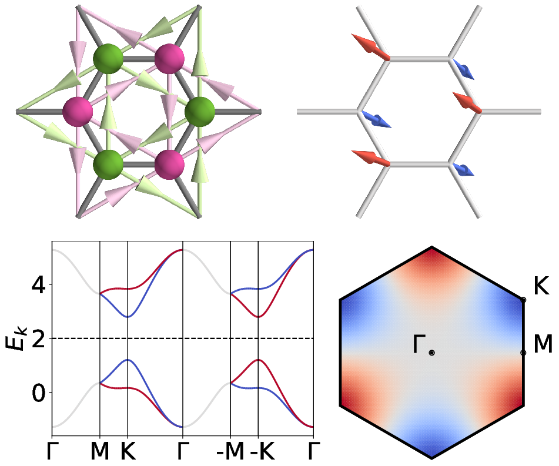

# CMTKit: Condensed Matter Theory Toolkit
CMTKit is a scientific Python library for versatile computations in theoretical condensed matter physics. Its main focus is on the theoretical models of diverse 1D, 2D, and 3D quantum materials and many-body lattice systems. The library is built upon fundamental scientific python libraries, such as NumPy, SciPy, and sparse for matrix and tensor computations, as well as Matplotlib (2D) and Mayavi (3D) for graphics.

The main features of this library include:
1. Public repository on GitHub: https://github.com/kappaping/cmtkit
2. Automatic modeling of arbitrary 1D to 3D quantum lattice models [[Paper]](https://arxiv.org/abs/2406.02671)
3. Automated computation of quantum states in lattice models:
    - Variational optimization of quantum states: Hartree-Fock(-Bogoliubov) theory [[Paper]](https://arxiv.org/abs/2503.09602)
    - Time-series analysis of quantum dynamics: Time-dependent Hartree-Fock(-Bogoliubov) theory [[Paper]](https://arxiv.org/abs/2411.10447)
    - Beyond mean field: Functional renormalization group (RG) [[Reference]](https://journals.aps.org/prb/abstract/10.1103/PhysRevB.106.125141)
    - Monte Carlo simulation: Classical spin systems, with metropolis and Wolff cluster update
4. Tensor network methods for strongly correlated quantum systems:
    - Essential tools for tensor networks, including a direct contraction of arbitrary diagrams
    - Variational optimization of layered network ansatz: Multiscale entanglement renormalization ansatz (MERA) [[Reference]](https://journals.aps.org/prb/abstract/10.1103/PhysRevB.79.144108)
5. Automated 3D visualization of lattices and quantum states [[Paper]](https://journals.aps.org/prb/abstract/10.1103/PhysRevB.110.L041121)

## Demo: Altermagnetism on a honeycomb lattice

This figure of altermagnetism ([arXiv:2503.09602](https://arxiv.org/abs/2503.09602)) demonstrates the computational and graphical capabilities in my package. The upper figures show (left) the Haldane model with charge currents on the honeycomb lattice, as well as (right) its altermagnetic ground state under repulsive interaction obtained by the Hartree-Fock theory. The lower figures show (left) the band structures with spin splitting and (right) the splitting energy map of the lower two occupied bands in the Brillouin zone.

  

## Setup

Please use the following steps to enable CMTKit for research use:

1. git clone [https://github.com/kappaping/cmtkit.git](https://github.com/kappaping/cmtkit.git)
2. Install the dependencies:
    - python=3.12
    - numpy=1.26
    - scipy
    - sympy
    - sparse
    - joblib
    - matplotlib
    - vtk=9.4.2
    - mayavi=4.8.3

The library currently needs to be used by importing relevant modules through sys.path.append. Stay tuned on future updates of objectizing the library for more convenient use!
